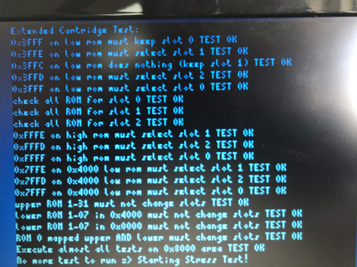

# Programming with the PicoGX

The PicoGX with firmware 1.0.4 and above has a developer mode. This mode consists of defining a cartridge that auto-flashes and auto-launches. This means that each time the Asmtrad is powered on, the defined cartridge is read from the SD, flashed in the Pico and launched without any menu displayed.  

This allow developers to test new released of their development.  

**How to proceed:**  
Edit or create the configuration file named `PicoGX.cfg` on the root of the SD  

    # Dangerous option for developers only. The PicoGX will auto-load and flash this cartridge without asking
    # The cartridge is not remembered and at start the cartridge will always be flashed if changed or not
    [Special]
    AutoFlash=Dev/MyGameLatest.cpr

Lines beginning with `#` are comments and ignored by the PicoGX.  
In `[Special]` section, the entry `AutoFlash` supports folders. In this exemple the folder `Dev` was used. Use `/` characters for folders, **not** Microsoft `\`.  
The cartridge named `MyGameLatest.cpr` will be auto-loaded and launched.  

**Usage:**  

0) Set the PicoGX.cfg file and connect a USB cable to the PicoGX
1) Connect the USB cable to your PC, this will mount the SD as drive, copy your updated cartridge to the SD
2) Unplug the USB cable from the PC
3) Start the Amstrad and the cartridge will auto launch, test your release
4) Power off the Amstrad
5) Goto 1

# Programming for the PicoGX

The PicoGX provides some functionalities not available to regular cartridges:  
+ More than 512kb cartridges  
+ High scores or anything else save and restore   

## How communication between the machine and the pico works

A cartridge is a read only device, and no write pin is available on the connector. This means everything is done by addresses.   
An example showing how the selection cartridge works is better than many words:  
```
Contact_Addr1 	EQU #133C
Contact_Addr2 	EQU #25C4

	ld bc,3 ; cd  
	ld a,(Contact_Addr1)  
	ld a,(Contact_Addr2)  
	ld a,(bc) ; command
```  
This code (Z80 assembly) will read something at address 0x133C, then address 0x25C4, the PicoGX will recognize this sequence and will consider the next read address as the command number. Here the PixoGX will execute the `CD` command.  

## Communicating with PicoGX

The PicoGX will detect the 2 addresses and the command if these addresses are read one after the other with nothing in between.  
This is only possible if the code is not in the cartridge but in RAM. If the code is in the cartridge, code fetching will occur in between and the PicoGX will not see proper consecutive addresses.  

## Accessing more than 512kb

When the PicoGX detects a cartridge more than 512kb in size, it will lookup for reserved addresses in the Bank 0 of the cartridge.  
 This is always bank 0, whatever mapping you apply using RMR2, so cartridge address from 0x000 to 0x3FFF.  
Detection is based on all the 19 bits set ignoring the 2 least weighted bits.
  
First 5 bits must be 0 (rom 0), then 12 bits must be 1 (0x3FFC).  
Then these 2 least weighted bits are used to select the bloc of 512kb to use:  
+ 11: Use base bloc of 512kb (Default launched bloc).  
+ 10: Use the second 512kb bloc (this is complete flip, the original loaded code is not accessible).  
+ 01: Use the third and last 512kb bloc.
+ 00: DO NOT USE! There is not enough flash space in the PicoGX for 2mb cartridges, So no change will happen.  

For exemple this code will ask the PicoGX to swap the cartridge content with the 2nd 512kb bloc:
```
	ld hl,#3FFE  
	ld a,(hl)  
```  
Run this code from memory and not from the cartridge, unless you prepared the cartridge in a way the next code is in same bank, same address on the target bloc.   

The switch is instant, the next read will be from the 2nd bloc. Any RMR or RMR2 mapping still applies, the machine is not aware of this change.   
   
This obviously only works if the cartridge is more than 512bk in size. The pico will do nothing if the cartridge is less or equal to 512kb and just return the data stored as this address as usual.  

  
_Test by Edouard BERGE working on the PicoGX_ 

## Saving progress, high score or anything else

With firmware 1.0.5 and above, games and applications written for it can save game progress, state, achievements... etc  
There is 16kb of space per software. The save name is based on the CPR name, .CPR replaced by .SAV, and stored in the "saves" folder on the SD Card.  

This folder will stay hidden from the Selection Menu since there is no .BIN or .CPR files inside.  

Each time a cpr is launched, the save is created in the pico memory and corresponding .SAV file loaded from the SD card if exists.  
If the save stays unused, it will not been saved on the SD card. It is saved when the `write` command is ended by a `stop` command.

### Writing to the save

To access this memory for write, the PicoGX sequence is required, then you send the commande `write`.  
Bank 0 must be activated for this to work, and all this code must run from the Amstrad memory  

    Contact_Addr1 	EQU #133C
    Contact_Addr2 	EQU #25C4

    ld bc,6 ; write
	ld a,(Contact_Addr1)
	ld a,(Contact_Addr2)
	ld a,(bc) ; command

Then any read to bank 0 will act as a write to the save. The write is sequencial and starts from the beginning of the save.  
This code for exemple will write 0x25, 0x25, 0x25, x025, 0xAA in the save file.  

	ld bc,#25
	ld a,(bc) ; save it
	ld bc,#25
	ld a,(bc) ; save it
	ld bc,#25
	ld a,(bc) ; save it
	ld bc,#25
	ld a,(bc) ; save it
	ld bc,#AA
	ld a,(bc) ; save it

To  stop the save and have back the content of Bank 0, run this stop command:  

	ld bc,7 ; stop
	ld a,(Contact_Addr1)
	ld a,(Contact_Addr2)
	ld a,(bc) ; command

 Each time the save is open for write, it restarts at the beginning.  
As soon as the write is ended by the `stop` command, the content will be saved to the SD card.  

### Reading the save

Read access is simplier and provides random access to the save.   
Open the save as read:  

	ld bc,5 ; read
	ld a,(Contact_Addr1)
	ld a,(Contact_Addr2)
	ld a,(bc) ; command

The Bank 0 is hidden and the content of the save is presented instead.  
This code will read byte located at the address 0x258 of the save:  

	ld lh,#258
	ld a,(hl)

To stop reading and get back Bank 0, it's the same command as for write:  

	ld bc,7 ; stop
	ld a,(Contact_Addr1)
	ld a,(Contact_Addr2)
	ld a,(bc) ; command

