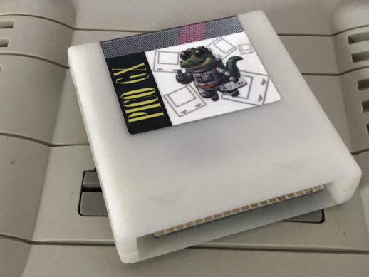
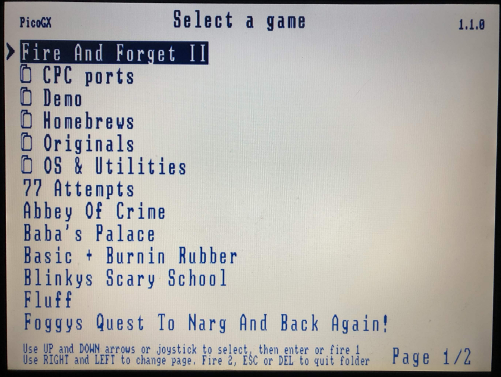
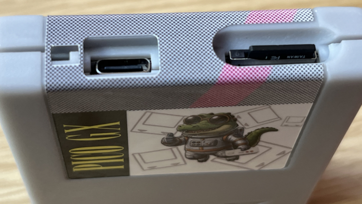

# PicoGX - A universal cartridge for Amstrad Plus and GX4000

## What is the PicoGX

The PicoGX is a cartridge for Amstrad Plus (464+ and 6128+) and GX4000 console loading cartridges from a MicroSD card.  
Featuring the same package form factor and size as original cartridges, it fits perfectly in the above-mentioned machines.

## Functionalities

+ Organize the SD as you wish, the PicoGX supports any folder structure of any depth.  
+ If SD card is removed, automatically launches the last loaded cartridge  
+ Present a clear and easy menu on the machine's own screen with detailed fonts  

+ Last loaded cartridge is always on top of the list with inverted colors for fast launch  
+ When connected with the USB-C port to a PC, act as an adapter and mount the SD as disk  
+ Supports future games/demos up to 1.5Mb in size  

## Connectivity

  
_The picture was taken at prototype time, the cartridge is now white and sticker suites better_

+ MicroSD slot for cartridges storage  
+ USB-C plug to connect to a PC as adapter or to update the firmware  
+ Hole hidding a button for firmware update  

## Where to buy it

In UK: [FlameLily shop](https://shop.flamelily.co.uk/picogx)  
In France: The shop is not ready yet to sell it  

## Updating the firmware

Firmware is evolving based on users feedback. The firmware version is displayed on top right of the CPC screen, you can compare with the latest release, check the "Releases" on the right of this page.  
To update the PicoGX firmware, get the latest .uf2 file, connect the USB-C port of the pico with a cable, push the button hidden 5mm under the hole and keep it pushed while you plug the other end of the cable to a PC.  
Then release the button when the PC makes a mounting sound. A USB disk drive called "RP2350" will mount. Drag & drop the .uf2 file in this folder. 
When flash is complete (it will take ~2 seconds), the folder disappears.  

To help pressing the button, I made a pin. If you have a 3D printer, print it.  
You can find it in 3Dpin folder.  

## Construction

The PCB is based on a Raspberry Pi Pico 2 model RP2354B and is using ENIG surface finish and gold plated contacts.  
The box is printed in automotive LEDO 6060 resin.  
The sticker is profesionnally made of vinyl.  

## Some custom cartridges

I made 3 cartridges  
+ Basic 1.1 f3 French from CPC 6128 (works on 6128+, will not on 464+ or GX4000 due to missing floppy controler)  
+ Basic 1.1 f4 French from "Burnin'Rubber + Basic" cartridge with Burnin and menu removed (works on all but useless on GX4000)  
+ Basic 1.1 v4 English from "Burnin'Rubber + Basic" cartridge with Burnin and menu removed (works on all but useless on GX4000)  

You will find them in the Cartridges folder, other languages will come soon  

## Greetings

Many thanks to Edouard BERGE for his [RASM compiler](https://github.com/EdouardBERGE/rasm) I used to make the CPC roms and also for his big help with the selection cartridge.  

Many thanks to BDCiron who is working on an alternative selection cartridge using ASIC acceleration, this firmware will be released in the future.  

Many thanks to FreddyV (the creator of the [PicoMEM](https://github.com/FreddyVRetro/ISA-PicoMEM)) for the help with Pico power supply, for components selection and BOM creation for the PicoGX.  

## Programming for the PicoGX

Follow [the link to this page](./Programming.md) to learn how to use 1.5MB cartridge and more to come.  